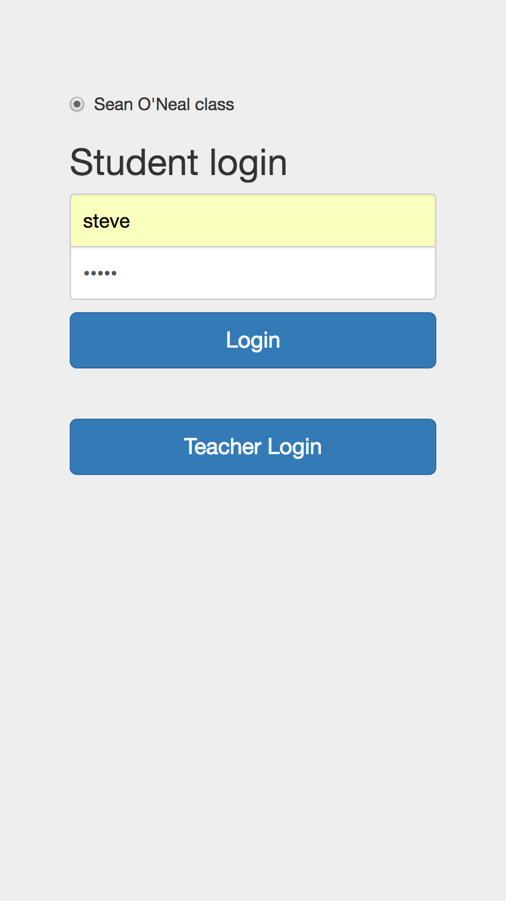
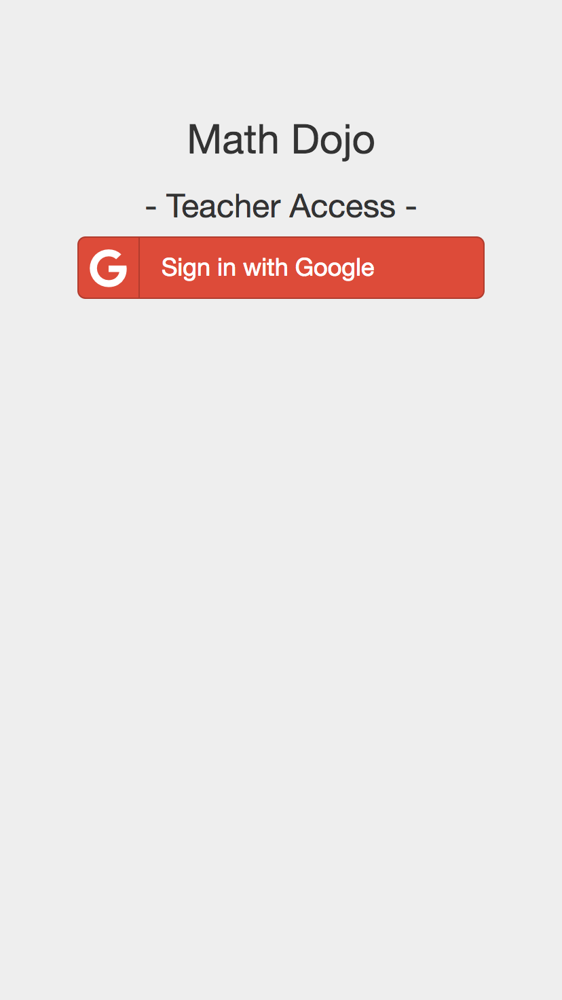
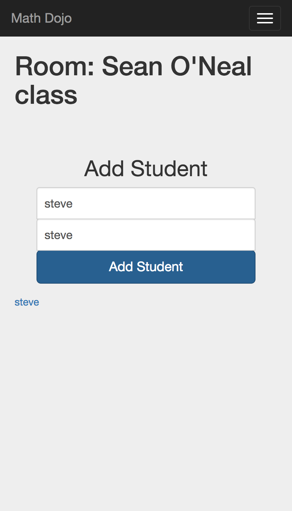
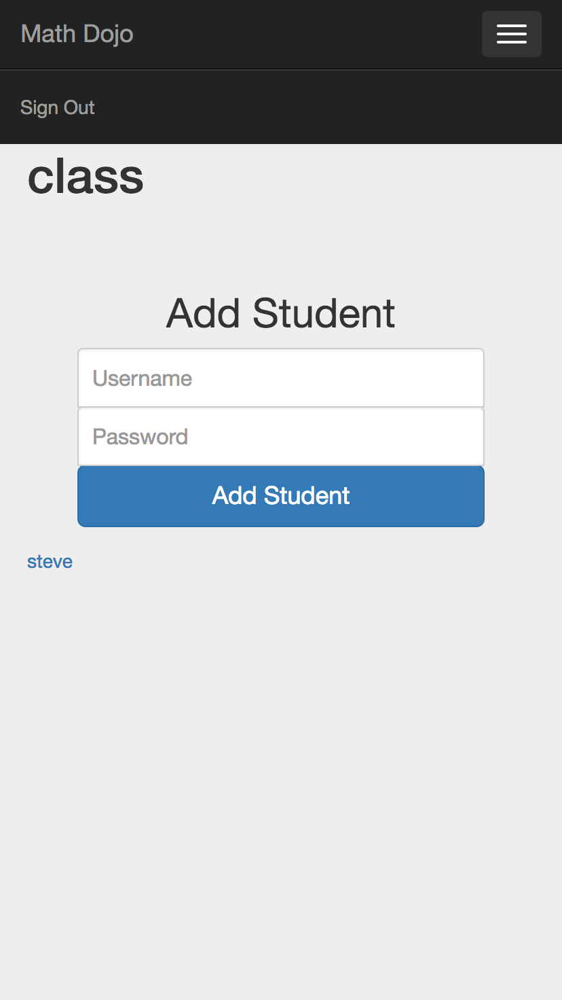
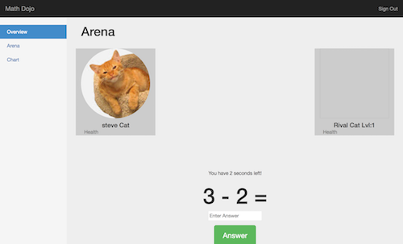
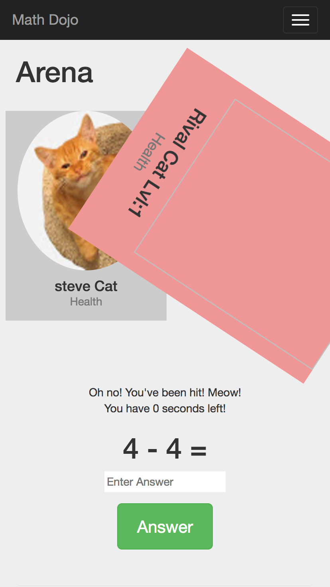

# :notebook: :100: Math Dojo



> A responsive, secure and interactive quiz application built for the classroom.

## :busts_in_silhouette: Team

  - [Aaron Trank](https://github.com/aarontrank)
  - [Sean O'Neal](https://github.com/sean-oneal)

## :sparkles: Table of Contents

1. [Team](#team)
1. [Usage](#usage)
1. [Requirements](#requirements)
1. [Development](#development)
    1. [Installing Dependencies](#installing-dependencies)
    1. [Tasks](#tasks)
    1. [Tech Stack](#techstack)
1. [Screenshots](#screenshots)
1. [Contributing](#contributing)

## :tada: Usage

> Math Dojo was developed and tested to be used from a mobile device, as well as on a desktop or laptop.  A valid and working Google Account is required for Teachers to login.  To start using Math Dojo, go to `localhost:3000` in your browser.

## :bangbang: Requirements

- Node
- MongoDB
- A valid Google Account

## :construction: Development

### Installing Dependencies

  From within the root directory:
  ```sh
    npm install
  ```

### :warning: Tasks

1. Open a separate terminal tab/window and launch `mongod`:
  - ```sh mongod```

1. From within the `/teacher` directory:
 - ```sh ../node_modules/.bin/webpack -d --watch ```

1. From within the `/student` directory:
  - ```sh ../node_modules/.bin/webpack -d --watch ```

1. From within the root `~/` directory, start server and webpack:
 - ```sh npm start ```

1. Alternatively, only have webpack watch:
 - ```sh npm run dev ```

#### Load the database with dummy data:
  ```sh
    npm run db
  ```

#### Clearing the Database:
  ```sh
      npm run reset
```

## Production Build
 ```sh
      npm run build
```

### :white_check_mark: Tech Stack
> The application was built using the MongoDB, Express, React/Redux, Node (MERN) stack, and incorporates the following technologies:

- React
- React Router
- Redux
- Express
- Mongoose
- Webpack
- PassportJS
- Google OAuth 2.0
- bCrypt
- Axios
- Express Sessions
- Bootstrap
- React Bootstrap
- Chart.js
- Morgan
- jQuery

### :computer: Screenshots

#### Teacher Application

  Login Screen
  

  Google OAuth Verification
  

  Responsive Dashboard
  

  Sign out Drop Down
  

#### Student Application:

  Login
  

  Desktop Dashboard
  

  Wrong Answer
  

## Contributing

See [CONTRIBUTING.md](CONTRIBUTING.md) for contribution guidelines.
